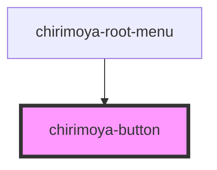

# chirimoya-button

<!-- Auto Generated Below -->

## Properties

| Property       | Attribute      | Description                                           | Type                            | Default    |
| -------------- | -------------- | ----------------------------------------------------- | ------------------------------- | ---------- |
| `alignContent` | `aligncontent` | alignment of the children elements                    | `"center" \| "left" \| "right"` | `'center'` |
| `isDisabled`   | `isdisabled`   | indicates the disabled status                         | `boolean`                       | `false`    |
| `isFullWidth`  | `isfullwidth`  | indicates full width for components like Alert Action | `boolean`                       | `false`    |

## Dependencies

### Used by

 - [chirimoya-root-menu](../chirimoya-root-menu)

### Graph

----------------------------------------------

*Built with [StencilJS](https://stenciljs.com/)*
