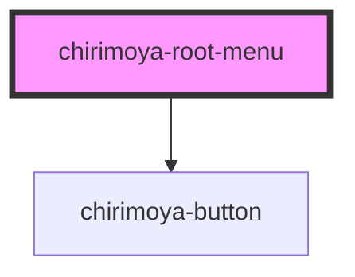

# chirimoya-root-menu

## Usage

```javascript
    <chirimoya-root-menu
      isOpen
    >
      <primaries-icon slot="menu-icon" icon="Coffee" class="menu-icon"/>

      <p slot="menu-title">Chiri</p>

      <chirimoya-navigation-item
        variant="label"
        isSelected
        isFullWidth
        onClick={(e:Event) => clickLinkMenu(e)}
        class="menu-item --selected"
        slot="menu-nav-item"
      >
        <primaries-icon icon="PaperTowels" slot="leading" class="menu-item-icon"/>
        <span>Menu 1</span>
      </chirimoya-navigation-item>
      <chirimoya-navigation-item
        variant="label"
        isFullWidth
        onClick={(e:Event) => clickLinkMenu(e)}
        class="menu-item"
        slot="menu-nav-item"
      >
        <primaries-icon icon="PaperTowels" slot="leading" class="menu-item-icon"/>
        <span>Menu 2</span>
      </chirimoya-navigation-item>
      <chirimoya-navigation-item
        variant="label"
        isFullWidth
        onClick={(e:Event) => clickLinkMenu(e)}
        class="menu-item"
        slot="menu-nav-item"
      >
        <primaries-icon icon="PaperTowels" slot="leading" class="menu-item-icon"/>
        <span>Menu 3</span>
      </chirimoya-navigation-item>
      
      <div slot="menu-user-info">
        <chirimoya-user-info>
          
          <p slot="user-name">Name</p>
          <p slot="user-email">Email</p>
        </chirimoya-user-info>
      </div>

      <chirimoya-navigation-item
        variant="label"
        isFullWidth
        slot="menu-user-nav-item"
      >
        <primaries-icon icon="PaperTowels" slot="leading"/>
        <span>User link 1</span>
      </chirimoya-navigation-item>

      <chirimoya-navigation-item
        variant="label"
        isFullWidth
        slot="menu-user-nav-item"
      >
        <primaries-icon icon="PaperTowels" slot="leading"/>
        <span>User link 2</span>
      </chirimoya-navigation-item>
      
      <nav slot="menu-footer-nav">
        <a href="#">Link 1</a>
        <a href="#">Link 2</a>
        <a href="#">Link 3</a>
      </nav>
      
      <p slot="menu-footer-copyright">2021 Cornershop by Uber</p>
    </chirimoya-root-menu>
```

<!-- Auto Generated Below -->


## Properties

| Property | Attribute | Description             | Type      | Default |
| -------- | --------- | ----------------------- | --------- | ------- |
| `isOpen` | `isopen`  | set if the menu is open | `boolean` | `false` |


## Events

| Event       | Description              | Type               |
| ----------- | ------------------------ | ------------------ |
| `closeMenu` | emit event on Close menu | `CustomEvent<any>` |


## Slots

| Slot                      | Description                                     |
| ------------------------- | ----------------------------------------------- |
| `"menu-footer-copyright"` | Use for add text of copyright on footer section |
| `"menu-footer-nav"`       | Use for add multiple links of footer section    |
| `"menu-icon"`             | Use for add main icon above Title               |
| `"menu-nav-item"`         | Use for add multiple items to the menu          |
| `"menu-title"`            | Use for add main title menu                     |
| `"menu-user-info"`        | Use for add user info component                 |
| `"menu-user-nav-item"`    | Use for add main title menu                     |


## Dependencies

### Depends on

- [chirimoya-button](../chirimoya-button)

### Graph


----------------------------------------------

*Built with [StencilJS](https://stenciljs.com/)*
